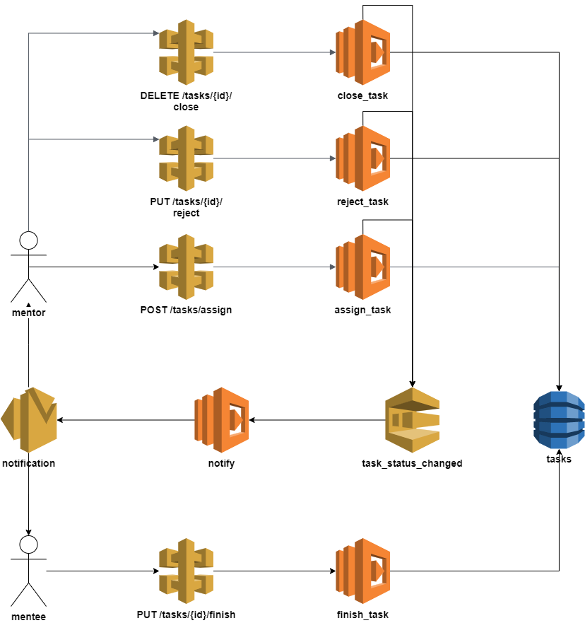

# Description

This is a practical task for 
[AWS serverless](https://www.linkedin.com/learning/aws-for-developers-data-driven-serverless-applications-with-kinesis)
course.

# Technical Task

1. Mentor Assigns Task to Mentee
1. Mentee receives notification that some has been assigned
1. Mentee Implements Task
1. Mentee notifies Mentor about implemented Task
1. Mentor verifies Task
1. Mentor can Approve and Close task
1. Mentor can Reject and ask Mentee to re-work Task

# Architecture

